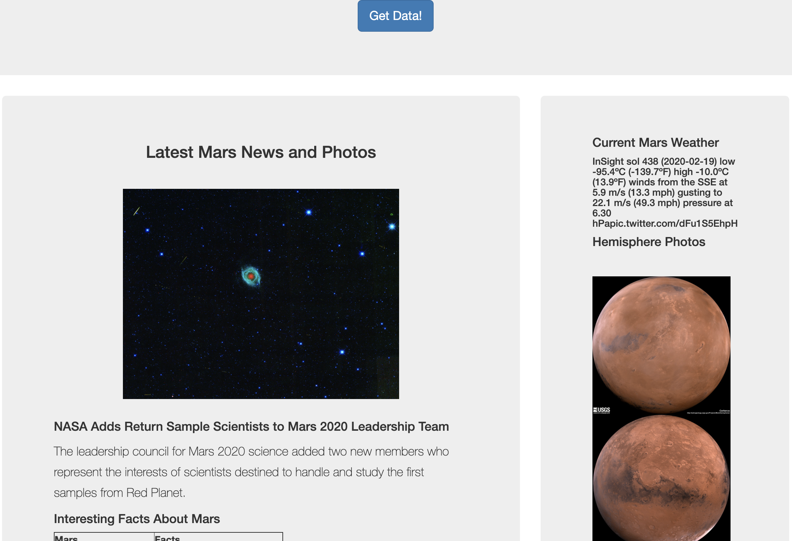

# Web Scraping Homework - Mission to Mars #

Web application that scrapes various websites for Mars related data, saves it to a MONGO database and then displays that information on a single HTML page.

#### Websites Scraped ####
* <https://mars.nasa.gov/news>
* <https://www.jpl.nasa.gov/spaceimages/?search=&category=Mars>
* <https://twitter.com/marswxreport>
* <https://space-facts.com/mars/>
* <https://astrogeology.usgs.gov/search/results?q=hemisphere+enhanced&k1=target&v1=Mars>
